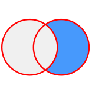
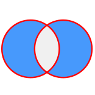

Вот подробная лекция на русском языке о конструкции `JOIN` в SQL на примере PostgreSQL, оформленная в Markdown. Лекция включает объяснения, примеры и разбор различных типов объединений с пошаговыми пояснениями.

---

# Лекция: SQL `JOIN` в PostgreSQL

## Введение

В реляционных базах данных данные часто распределены между несколькими таблицами, связанными между собой через ключи. Для объединения информации из этих таблиц используется операция `JOIN` в SQL. PostgreSQL поддерживает все стандартные типы `JOIN`, которые позволяют комбинировать строки из разных таблиц на основе заданных условий.

В этой лекции мы разберём:
- Что такое `JOIN` и зачем он нужен.
- Типы `JOIN`: `INNER JOIN`, `LEFT JOIN`, `RIGHT JOIN`, `FULL JOIN`, `CROSS JOIN`.
- Практические примеры с пояснениями.

---

## Что такое `JOIN`?

`JOIN` — это операция в SQL, которая объединяет строки из двух или более таблиц на основе общего условия (обычно совпадения значений в определённых столбцах). Условие объединения задаётся с помощью ключевого слова `ON`.

### Общий синтаксис
```sql
SELECT column1, column2, ...
FROM table1
[JOIN_TYPE] JOIN table2
ON table1.column = table2.column
[WHERE condition];
```

- `[JOIN_TYPE]` — тип объединения (например, `INNER`, `LEFT` и т.д.).
- `ON` — условие, определяющее, как строки из таблиц связаны.

---

## Подготовка данных

Для примеров создадим две таблицы: `users` (пользователи) и `orders` (заказы).

### Таблица `users`
```sql
CREATE TABLE users (
    id SERIAL PRIMARY KEY,
    name TEXT NOT NULL,
    email TEXT UNIQUE
);

INSERT INTO users (name, email) VALUES
    ('Иван Иванов', 'ivan@example.com'),
    ('Мария Петрова', 'maria@example.com'),
    ('Алексей Сидоров', 'alexey@example.com');
```

### Таблица `orders`
```sql
CREATE TABLE orders (
    order_id SERIAL PRIMARY KEY,
    user_id INT REFERENCES users(id),
    amount DECIMAL NOT NULL
);

INSERT INTO orders (user_id, amount) VALUES
    (1, 150.50),  -- заказ Ивана
    (2, 200.00),  -- заказ Марии
    (1, 75.25);   -- ещё один заказ Ивана
```

- У `users` есть три пользователя.
- У `orders` есть три заказа, но только для двух пользователей (Алексей не делал заказов).

---

## Типы `JOIN`

### 1. `INNER JOIN`
`INNER JOIN` возвращает только те строки, где условие объединения выполняется в обеих таблицах.
INNER JOIN


#### Пример
```sql
SELECT u.name, o.order_id, o.amount
FROM users u
INNER JOIN orders o
ON u.id = o.user_id;
```

**Результат:**
```
    name       | order_id | amount
---------------+----------+--------
 Иван Иванов   |    1     | 150.50
 Мария Петрова |    2     | 200.00
 Иван Иванов   |    3     | 75.25
```

- Алексей Сидоров отсутствует, так как у него нет заказов (нет совпадений в `orders`).
- `INNER JOIN` — самый строгий тип объединения, возвращает только пересечение данных.

---

### 2. `LEFT JOIN` (или `LEFT OUTER JOIN`)
`LEFT JOIN` возвращает все строки из левой таблицы (`users`) и соответствующие строки из правой (`orders`). Если совпадений нет, возвращаются значения `NULL` для столбцов правой таблицы.
LEFT JOIN


LEFT OUTER JOIN


#### Пример
```sql
SELECT u.name, o.order_id, o.amount
FROM users u
LEFT JOIN orders o
ON u.id = o.user_id;
```

**Результат:**
```
    name         | order_id | amount
-----------------+----------+--------
 Иван Иванов     |    1     | 150.50
 Иван Иванов     |    3     | 75.25
 Мария Петрова   |    2     | 200.00
 Алексей Сидоров |   NULL   |  NULL
```

- Все пользователи включены, даже Алексей, у которого нет заказов (`order_id` и `amount` — `NULL`).
- `LEFT JOIN` полезен, когда нужно сохранить все записи из основной таблицы.

---

### 3. `RIGHT JOIN` (или `RIGHT OUTER JOIN`)
`RIGHT JOIN` противоположен `LEFT JOIN`: возвращает все строки из правой таблицы (`orders`) и соответствующие строки из левой (`users`). Если совпадений нет, возвращаются `NULL` для столбцов левой таблицы.
RIGHT JOIN
 
RIGHT OUTER JOIN


#### Пример
```sql
SELECT u.name, o.order_id, o.amount
FROM users u
RIGHT JOIN orders o
ON u.id = o.user_id;
```

**Результат:**
```
    name       | order_id | amount
---------------+----------+--------
 Иван Иванов   |    1     | 150.50
 Мария Петрова |    2     | 200.00
 Иван Иванов   |    3     | 75.25
```

- Алексей отсутствует, так как у него нет заказов, а все заказы из `orders` включены.
- `RIGHT JOIN` редко используется, так как его можно заменить `LEFT JOIN`, поменяв порядок таблиц.

---

### 4. `FULL JOIN` (или `FULL OUTER JOIN`)
`FULL JOIN` возвращает все строки из обеих таблиц. Если нет совпадений, заполняет недостающие столбцы значениями `NULL`.
FULL JOIN

FULL OUTER JOIN


#### Пример
```sql
SELECT u.name, o.order_id, o.amount
FROM users u
FULL JOIN orders o
ON u.id = o.user_id;
```

**Результат:**
```
    name         | order_id | amount
-----------------+----------+--------
 Иван Иванов     |    1     | 150.50
 Иван Иванов     |    3     | 75.25
 Мария Петрова   |    2     | 200.00
 Алексей Сидоров |   NULL   |  NULL
```

- Включены все пользователи и все заказы, даже если связи нет.
- `FULL JOIN` полезен для анализа данных, где важно учесть все записи.

---

### 5. `CROSS JOIN`
`CROSS JOIN` создаёт декартово произведение: каждую строку из одной таблицы комбинирует с каждой строкой из другой. Условие `ON` не требуется.


#### Пример
```sql
SELECT u.name, o.order_id
FROM users u
CROSS JOIN orders o;
```

**Результат:**
```
    name         | order_id
-----------------+----------
 Иван Иванов     |    1
 Иван Иванов     |    2
 Иван Иванов     |    3
 Мария Петрова   |    1
 Мария Петрова   |    2
 Мария Петрова   |    3
 Алексей Сидоров |    1
 Алексей Сидоров |    2
 Алексей Сидоров |    3
```

- Всего 9 строк (3 пользователя × 3 заказа).
- `CROSS JOIN` используется редко, но полезен для генерации всех возможных комбинаций.

---

## Сложные примеры

### Добавление третьей таблицы: `products`
```sql
CREATE TABLE products (
    product_id SERIAL PRIMARY KEY,
    name TEXT NOT NULL,
    price DECIMAL NOT NULL
);

INSERT INTO products (name, price) VALUES
    ('Книга', 20.00),
    ('Ручка', 5.50);

CREATE TABLE order_items (
    order_id INT REFERENCES orders(order_id),
    product_id INT REFERENCES products(product_id),
    quantity INT NOT NULL
);

INSERT INTO order_items (order_id, product_id, quantity) VALUES
    (1, 1, 2),  -- 2 книги в заказе 1
    (1, 2, 1),  -- 1 ручка в заказе 1
    (2, 1, 3);  -- 3 книги в заказе 2
```

### Пример с несколькими `JOIN`
Получим информацию о заказах, пользователях и товарах:
```sql
SELECT 
    u.name AS user_name, 
    o.order_id, 
    p.name AS product_name, 
    oi.quantity, 
    p.price * oi.quantity AS total_cost
FROM users u
INNER JOIN orders o ON u.id = o.user_id
INNER JOIN order_items oi ON o.order_id = oi.order_id
INNER JOIN products p ON oi.product_id = p.product_id;
```

**Результат:**
```
 user_name    | order_id | product_name | quantity | total_cost
--------------+----------+--------------+----------+------------
 Иван Иванов  |    1     | Книга        |    2     |   40.00
 Иван Иванов  |    1     | Ручка        |    1     |   5.50
 Мария Петрова|    2     | Книга        |    3     |   60.00
```

- Три `INNER JOIN` связывают таблицы через ключи.
- Вычисляем стоимость каждого товара (`price * quantity`).

---

## Полезные советы

1. **Псевдонимы**: Используйте (`AS` или короткие имена, например, `u`, `o`), чтобы запросы были читаемыми.
2. **Индексы**: Создавайте индексы на столбцы, используемые в `ON` (например, `CREATE INDEX ON orders(user_id);`), для повышения производительности.
3. **Фильтрация**: Добавляйте `WHERE` для ограничения результатов:
   ```sql
   SELECT u.name, o.amount
   FROM users u
   LEFT JOIN orders o ON u.id = o.user_id
   WHERE o.amount > 100;
   ```

---

## Заключение

Операция `JOIN` в PostgreSQL — мощный инструмент для работы с реляционными данными. Понимание различий между `INNER`, `LEFT`, `RIGHT`, `FULL` и `CROSS JOIN` позволяет гибко комбинировать таблицы в зависимости от задачи. Освоив базовые примеры и перейдя к сложным запросам с несколькими таблицами, вы сможете эффективно анализировать и обрабатывать данные.

Если у вас есть вопросы или нужен разбор конкретного примера — дайте знать!

---

Надеюсь, лекция была полезной! Если нужно что-то дополнить или уточнить, сообщите.